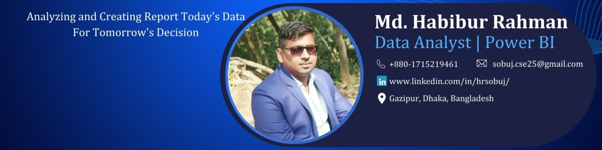

# 👋 Hi there, I'm Md Habibur Rahman

🎯 ** Senior Business Analyst (Information Technology) | Epyllion Group**

🔍 Passionate about data-driven decision-making, business automation, and ERP transformation. I specialize in building insightful Power BI dashboards, writing efficient SQL queries, and integrating enterprise data systems.

---

## 🧠 About Me

- 💼 Currently working at **Epyllion Group** (Feb 2022 – Present)
- 🏢 Industry: Garments, Carton, Poly, Labels, and Narrow Fabrics
- 📊 Expertise in: Power BI, SQL, Excel, ERP (SAP S/4HANA), Python (beginner)
- 📚 Education: MSc in CSE | PGD in Data Science

---

## 🚀 Projects

Here are a few of my favorite analytics projects:

### 📈 [Sales Performance Dashboard – Power BI](https://github.com/HRSobuj25/Sales-Performance-Dashboard)
A full interactive dashboard with YoY comparison, region-wise breakdown, and target vs actual performance.

### 🧾 [ERP Material Movement Report – SQL + Power BI](https://github.com/HRSobuj25/ERP-Material-Movement)
SQL-based backend with Power BI frontend to track inward/outward materials across multiple warehouses.

### 📦 [Inventory Forecasting – Python](https://github.com/HRSobuj25/Inventory-Forecasting)
Basic inventory prediction model using Python’s `pandas` and `prophet`.

---

## 🛠️ Tools & Technologies

---

## 📊 GitHub Stats

---

## 🔗 Let's Connect

---

### 🔥 "Turning raw data into real insights!"
